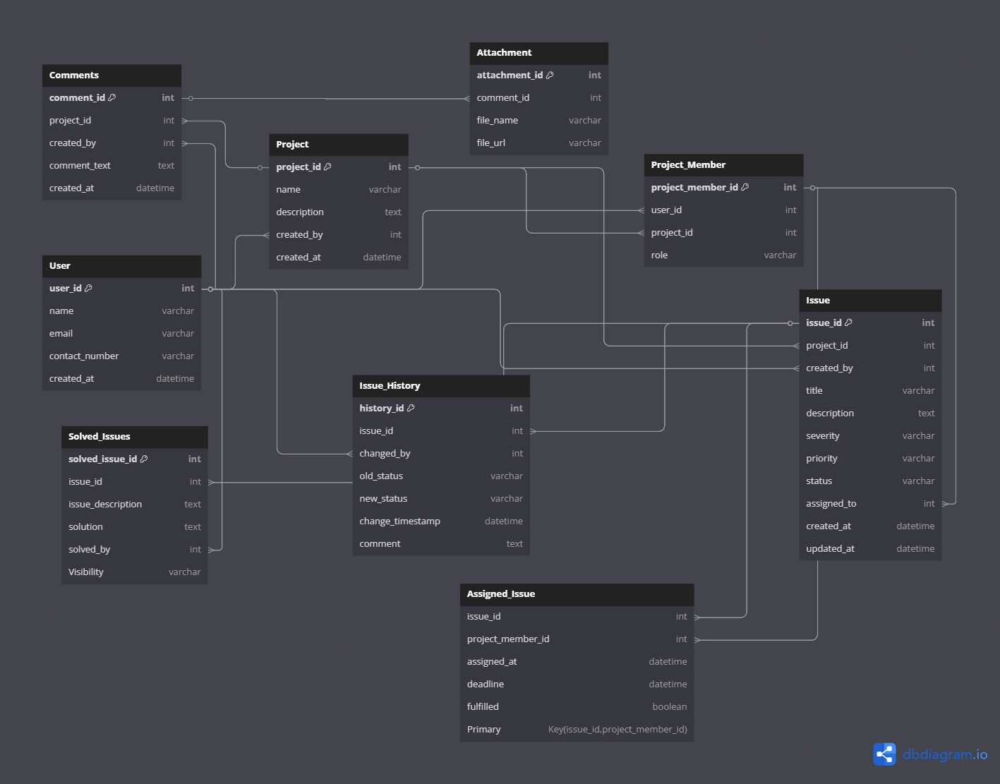
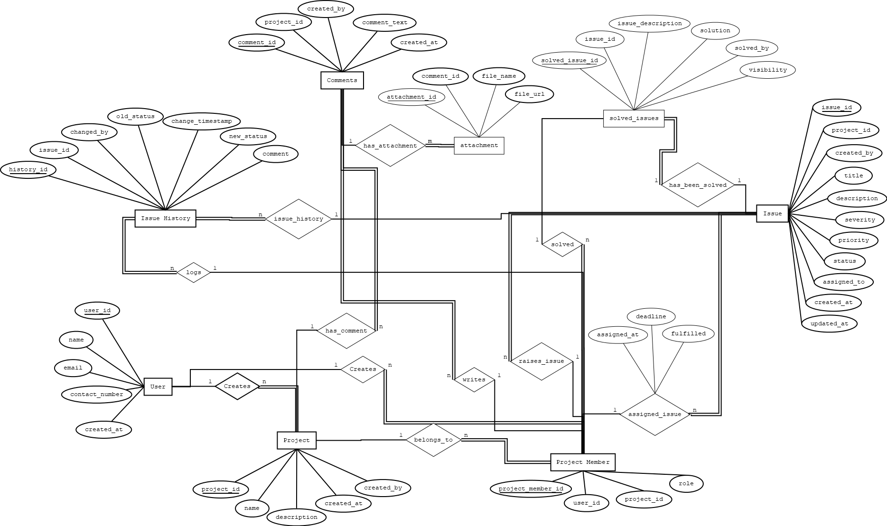

# Bug Tracking System - Database Design & Architecture

A robust database back-end architecture designed for a comprehensive Bug Tracking System. This project showcases structured database normalization, relational mapping, and implementation-ready SQL scripts designed to handle agile project lifecycles, user authentication roles, and problem-resolution workflows.

## 📌 Project Overview
The system tracks issues/bugs throughout their lifecycle within distinct projects. It manages multiple user tiers (managers, developers, testers), assigns ownership to specific bug reports, tracks real-time discussion comments, and maintains historical logs for auditing all status modifications.

## 🛠️ Design & Normalization Features
- **ER to Relational Schema Mapping**: Translated real-world entities (Users, Issues, Comments) into an optimized, clean tabular layout.
- **Strict Normalization (Boyce-Codd Normal Form - BCNF)**: Analyzed and verified all functional dependencies to eliminate redundant data storage and insertion/deletion anomalies.
- **Referential Integrity Constraints**: Built complete table linkages using cascading foreign keys, data verification checks (`CHECK`), and constraints tailored for distinct deployment environments.

---

## 🗺️ Architectural Diagrams

### 1. Entity-Relationship (ER) Diagram
*Visual mapping of system entities, attributes, and precise cardinality constraints (1:N, M:N).*


### 2. Relational Schema
*Detailed look at relational tables, primary keys, and exact foreign key references.*


---

## 📊 Normalization & Functional Dependencies (FDs)
Every schema table satisfies the rigorous criteria for **BCNF** as demonstrated below:

### 1. Users
- **FDs**: `user_id` ➔ `name`, `email`, `contact_number`, `created_at`
- **Proof**: `user_id` is the primary Superkey. Because every LHS of the functional dependency is a superkey, the table adheres strictly to BCNF rules.

### 2. Project
- **FDs**: `project_id` ➔ `name`, `description`, `created_by`, `created_at`
- **Proof**: `project_id` functions as the primary Superkey. All operational dependencies stem directly from this key, making it BCNF compliant.

### 3. ProjectMember
- **FDs**: `project_member_id` ➔ `user_id`, `project_id`, `role`
- **Proof**: `project_member_id` is the Superkey.

### 4. Issue
- **FDs**: `issue_id` ➔ `project_id`, `created_by`, `title`, `description`, `severity`, `priority`, `status`, `assigned_to`, `created_at`, `updated_at`
- **Proof**: `issue_id` serves as the primary Superkey. 

### 5. Assigned
- **FDs**: `(issue_id, project_member_id)` ➔ `assigned_at`, `deadline`, `fulfilled`
- **Proof**: Uses a composite Primary/Superkey `(issue_id, project_member_id)`, satisfying BCNF.

### 6. Comment
- **FDs**: `comment_id` ➔ `issue_id`, `created_by`, `comment_text`, `created_at`
- **Proof**: `comment_id` is the Superkey.

### 7. IssueHistory
- **FDs**: `history_id` ➔ `issue_id`, `changed_by`, `old_status`, `new_status`, `change_timestamp`, `comment`
- **Proof**: `history_id` is the Superkey.

---

## 🚀 How to Run the Database Script
The relational schema is configured for standard SQL platforms (like PostgreSQL).

1. Clone this repository or copy the code from `schema.sql`.
2. Open your database terminal or administration tool (e.g., pgAdmin, DBeaver).
3. Execute the script to instantiate the tables:
   ```sql
   \i schema.sql
